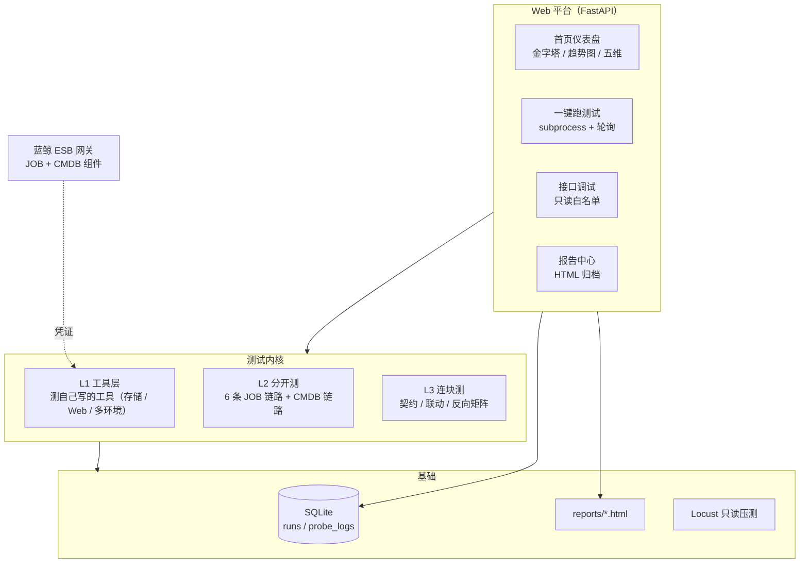

# 蓝鲸双系统端到端测试平台

> CMDB（配置管理）+ JOB（作业平台）双系统的全方位测试平台：
> pytest 分层用例 + FastAPI 后端 + Vue3/Element Plus 前端 + SQLite 留痕 + Locust 压测，
> 覆盖功能 / 性能 / 安全 / 边界 / 端到端五个维度，另有 AI 自愈用例生成 + UI 自动化。


## 一、项目定位

面试作业背景：对蓝鲸 **CMDB 和 JOB 两套系统**做全方位测试——
功能 / 性能 / 安全 / 边界 / 端到端五个维度，集合成一个测试平台。

**两个系统平等对待，各自都是被测对象：**

1. **CMDB 自身**：业务 / 主机 / 拓扑 / 模型 / 动态分组等功能链路，及其性能、安全、参数边界
2. **JOB 自身**：6 条核心链路（脚本 / 快速执行 / 编排 / 定时 / 账号+高危 / 文件+SQL），及其性能、安全、参数边界
3. **端到端**：两系统联动，验证数据契约（业务 ID / 主机 ID / 动态分组 ID / 拓扑节点）对得上

一句话定位：**一台给蓝鲸 CMDB 和 JOB 两个系统做全方位体检的机器**——
功能、性能、安全、边界、端到端五个维度，两个系统平等覆盖，一键跑、出报告。

## 二、目录结构

```text
bk-test-platform/
├── app/                          产品代码（测试内核的"手"和"操作台"）
│   ├── api_client.py             JOB ESB 客户端（38 个接口封装，三件套认证）
│   ├── cmdb_client.py            CMDB ESB 客户端（业务/主机/拓扑/模型/分组查询 + 写操作）
│   ├── base_client.py            ESB 客户端基类（统一拼 URL + 三件套 + 查结果）
│   ├── envs.py                   多环境管理（一套代码切多套环境，凭证不入库）
│   ├── envs.example.json         多环境模板（真凭证写 envs.local.json，已 gitignore）
│   ├── storage.py                SQLite 存储层（执行记录 runs + 探针日志 probe_logs）
│   ├── case_index.py             用例索引（ast 提取，供用例库页 + 导出 CSV）
│   ├── web_app.py                FastAPI 后端（API 路由 + 托管前端 build 产物）
│   ├── gen_cases.py              AI 用例生成器（调 DeepSeek，需 LLM_API_KEY）
│   ├── gen_heal.py               AI 自愈闭环（生成→跑→失败喂回修→重试，参考 ghost）
│   └── job_config.py             单环境配置（真凭证走 job_config_local.py，已 gitignore）
├── frontend/                     Vue3 + Element Plus 前端（npm run build 后由后端托管）
│   └── src/                      页面：总览/跑测试/接口调试/报告/AI生成/用例库/UI自动化
├── tests/                        测试用例（151 个 / 139 函数，含 20 个 UI 用例，按 marker 分层）
│   ├── conftest.py               公共 fixture（job_client/cmdb_client，凭证缺失诚实 skip）
│   ├── test_job_script.py        JOB 链路 1：脚本管理
│   ├── test_job_fast_exec.py     JOB 链路 2：快速执行
│   ├── test_job_plan.py          JOB 链路 3：作业编排
│   ├── test_job_cron.py          JOB 链路 4：定时任务
│   ├── test_job_account.py       JOB 链路 5：账号与高危命令检测
│   ├── test_job_file_sql.py      JOB 链路 6：文件分发与 SQL
│   ├── test_cmdb_core.py         CMDB 独立链路
│   ├── test_integration.py       跨系统联调（数据契约）
│   ├── test_job_boundary.py      参数边界
│   ├── test_security.py          安全（鉴权/越权/注入/高危命令）
│   ├── test_storage.py           存储层
│   ├── test_webapp.py            Web 平台层（冒烟计划排除，防自引用）
│   ├── test_envs.py              多环境管理单元测试
│   └── ui/                       UI 自动化（Playwright）：测自己平台（部署在服务器）/ 测 CMDB / 测 JOB 骨架
├── scripts/                      工具脚本
│   ├── run_tests.py              统一测试入口（全量/链路 + HTML 报告 + --env 切环境）
│   ├── locustfile.py             只读接口压测（Locust）
│   ├── export_cases.py           导出用例清单 CSV
│   ├── gen_api_docs.py           生成 API 参考文档（扫描客户端公开方法）
│   └── gen_cmdb_docs.py          生成 CMDB 接口文档
├── docs/                         策略/架构/API 文档 + 接口文档（apidoc/ JOB 38 份 + apidoc_cmdb/ CMDB 7 份）+ 面试问答卡
├── reports/                      HTML 报告（gitignore）
├── data/                         SQLite 数据库（gitignore）
├── .github/workflows/ci.yml      GitHub Actions（push 跑测试 + 回写覆盖率徽章）
├── pytest.ini                    13 个 marker 注册
├── badge.svg                     覆盖率徽章（CI 自动回写）
└── requirements.txt              依赖清单
```

## 三、架构



## 四、工作流程

```text
启动 Web 平台（app/web_app.py）
    │
    ▼
浏览器打开 http://127.0.0.1:8000
    │
    ▼
选测试计划（冒烟 / 回归 / 只JOB / 只连块测）
    │
    ▼
后台 subprocess 跑 pytest
    ├── 用例调 JobClient / CmdbClient
    ├── 客户端拼 URL + 认证三件套 → 请求蓝鲸 ESB 网关
    ├── 蓝鲸返回 {result, code, data} → 客户端检查结果
    └── 断言对答案：通过 / 失败 / 跳过
    │
    ▼
落库 SQLite（runs）+ 生成 HTML 报告（latest.html）
    │
    ▼
首页趋势图 + 报告中心展示结果
```

## 五、测试体系

### 1. 测试分层（金字塔）

| 层 | 对齐术语 | 内容 | 触发 |
|----|---------|------|------|
| L1 | 工具层 | 测自己写的工具（拼参、Base64、分页、存储、Web 层、多环境） | `-m unit`，不等账号 |
| L2 | 分开测 | JOB 六链路 + CMDB 独立链路，故障隔离 | `-m script` 等按链路 |
| L3 | 连块测 | 跨系统矩阵：契约一致性 / 业务联动 / 隔离反向 | `-m integration` |

三组 L3 场景围绕数据契约组织：

- **契约一致性**（只读）：JOB 的 `bk_scope_id` == CMDB 的 `bk_biz_id`，
  `host_id` == `bk_host_id`，`dynamic_group_list[].id` == CMDB 分组 ID，
  `topo_node.id` == CMDB 拓扑实例 ID
- **业务联动**：CMDB 圈人（动态分组）→ JOB 干活（快速执行 / 文件分发）
- **隔离反向**（负面）：CMDB 不存在的幽灵主机 / 幽灵分组，JOB 必须拒绝

### 2. 五个测试维度

| 维度 | 大白话问什么 | 载体 |
|------|-------------|------|
| 功能 | 对不对？ | 151 个分层用例 |
| 性能 | 快不快？ | `scripts/locustfile.py` 只读压测 |
| 安全 | 漏不漏？ | `tests/test_security.py`（鉴权/越权/注入/高危） |
| 边界 | 临界点崩不崩？ | `tests/test_job_boundary.py`（等价类/边界值/非法值） |
| 端到端 | 连起来对不对？ | `tests/test_integration.py`（数据契约） |

### 3. 诚实原则

未配置凭证时，全部诚实 skip（不造假绿）：
57 个 unit 用例正常跑，74 个环境层用例等账号激活，
另有 20 个 UI 用例需浏览器（传 --run-ui + 系统浏览器）。

## 六、快速开始

```bash
# 1. 安装依赖（Python 3.10+）
pip install -r requirements.txt

# 2. 配置凭证：复制 app/job_config.py 为 app/job_config_local.py，
#    在 local 文件里填三件套（模板入库、真凭证不入库，见 docs/申请指引）

# 3. 跑测试
python scripts/run_tests.py -m "unit and not platform"  # 冒烟 50 个，不等账号秒出
python scripts/run_tests.py -m unit                     # unit 层 57 个（含 7 个 Web 层）
python scripts/run_tests.py                             # 全量 151 用例 + HTML 报告

# 4. 构建前端（首次或改前端后；需要 Node.js）
cd frontend && npm install && npm run build && cd ..

# 5. 启动 Web 平台（托管前端 build 产物 + 提供 API）
python app/web_app.py                      # → http://127.0.0.1:8000
# 前端开发模式（热更新）：cd frontend && npm run dev  → http://localhost:5173

# 6. 性能压测（可选，凭证配好后）
locust -f scripts/locustfile.py --host <ESB_HOST>
```

### 多环境切换（可选）

一套代码切多套环境（体验环境 / 本地 CMDB / 生产），不用改 `job_config.py`：

```bash
# 1. 复制模板，填真凭证（不入库）
#    Windows：copy app\envs.example.json app\envs.local.json
#    Linux/Mac：cp app/envs.example.json app/envs.local.json

# 2. 按环境名跑（不传 --env 则走 job_config.py，行为不变）
python scripts/run_tests.py --env experience        # 体验环境
python scripts/run_tests.py -m cmdb --env local_cmdb

# 客户端代码里也可直接指定环境
JobClient(env='experience')
CmdbClient(env='local_cmdb')
```

取值优先级：**显式参数 > env 配置 > job_config.py 默认值**。

### 部署到服务器（公网访问）

```bash
# 前端先 build，再启动后端（托管前端 build 产物 + 提供 API）
cd frontend && npm install && npm run build && cd ..
cd bk-test-platform
PLATFORM_USER=jwkj PLATFORM_PASSWORD=jwkj nohup python3 -m uvicorn app.web_app:app \
  --host 0.0.0.0 --port 8000 > platform.log 2>&1 &
# 然后在云服务器安全组放行 8000 端口，访问 http://<公网IP>:8000
```

**登录认证**：设了 `PLATFORM_PASSWORD` 后，访问会进自定义登录页（token 认证），
账号密码由 `PLATFORM_USER` / `PLATFORM_PASSWORD` 决定。不设置则完全放行（适合本地开发）。
默认账号密码：`jwkj / jwkj`。

## 七、Web 平台能力（七模块）

- **登录认证**：自定义登录页 + token 会话（账号密码走 `PLATFORM_USER`/`PLATFORM_PASSWORD`）
- **总览**：统计卡片 + 分层金字塔（点击跳转用例库）+ 趋势图（绿/红/黄堆叠 + 通过率）+ 最近执行 + 五维
- **跑测试**：冒烟/回归/只 JOB/只连块测/全量，实时进度条，失败用例结构化展示
- **接口调试**：参数说明内嵌（自动解析 apidoc）+ 历史请求回填 + 结果复制，只读白名单
- **报告**：通过率标签 + 绿/红/黄数 + 删除
- **AI 生成**：生成草稿 + 自愈闭环（生成→跑→修，参考 ghost）+ 自愈 diff + 生成历史回溯
- **用例库**：左右分栏分组导航 + 分页 + 优先级(P0/P1/P2) + 最近执行状态 + 详情抽屉
- **UI 自动化**：左侧分组导航（测自己平台 / 测 CMDB / 测 JOB）、一键运行、失败自动截图 + HTML 报告
- **历史留痕**：SQLite 落库（runs + probe_logs），可审计可扩展

## 八、设计取舍

- **为什么前后端分离（Vue3 + FastAPI）**：前端 Vue3/Element Plus 独立项目，后端 FastAPI 纯 API + 托管前端 build 产物，
  同源部署无 CORS 问题；比「单文件内嵌 HTML」更适合持续长大
- **为什么 SQLite 不 MySQL**：单机零运维，sqlite3 标准库，足够趋势图场景；多人协作再换 MySQL
- **为什么压测只压只读**：共享体验环境黑名单约束，只读接口无副作用且是线上高频
- **为什么不造假绿**：凭证没到就 skip 并提示下一步，绝不 mock 成 pass
- **为什么多环境是叠加式**：`envs.py` 在 `job_config.py` 之上叠一层，旧用法不破坏，
  真凭证走 `envs.local.json`（gitignore）不入库；架构详见 `docs/ARCHITECTURE.md`
- **为什么 AI 生成要限流 + 登录**：key 内置服务端，公网接口必须防滥用烧钱（每 IP 每分钟限 8 次 + 全站 token 登录）

## License

MIT
