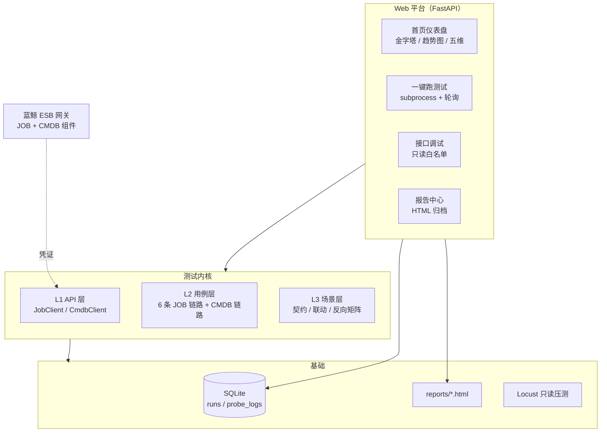

# 蓝鲸双系统端到端测试平台

> CMDB（配置管理）+ JOB（作业平台）双系统的全方位测试平台：
> pytest 分层用例 + FastAPI Web 平台 + SQLite 历史留痕 + Locust 只读压测，
> 覆盖功能 / 性能 / 安全 / 边界 / 端到端五个维度，另有 AI 用例生成。


## 一、项目定位

面试作业背景：蓝鲸 JOB 提供 40+ ESB 接口，CMDB 提供配套查询接口，
两个系统通过业务 ID、主机 ID、动态分组 ID 三个数据契约耦合。

本平台回答两个核心问题：

1. **JOB 的每条链路单独工作正常吗？** —— 分层用例，故障隔离
2. **两个系统连起来数据对得上吗？** —— 场景矩阵，按契约组织

在这两个问题之上，按"全方位测试"覆盖五个维度：
**功能 / 性能 / 安全 / 边界 / 端到端**，全收在一个 Web 平台入口下
（详见 `docs/2026-08-23-全方位测试方案.md`）。

一句话定位：**一台给蓝鲸 CMDB 和 JOB 做自动化体检的机器**——98 个检查项目，
一键跑、出报告，检查两套系统各自好不好、连起来数据对不对得上。

## 二、目录结构

```text
job-test/
├── app/                          产品代码（测试内核的"手"和"操作台"）
│   ├── api_client.py             JOB ESB 客户端（38 个接口封装，三件套认证）
│   ├── cmdb_client.py            CMDB ESB 客户端（业务/主机/拓扑/模型/分组查询）
│   ├── storage.py                SQLite 存储层（执行记录 runs + 探针日志 probe_logs）
│   ├── web_app.py                Web 平台（FastAPI 单文件，内嵌 HTML，含测试计划 PLANS）
│   ├── gen_cases.py              AI 用例生成器（调 DeepSeek，需 LLM_API_KEY）
│   └── job_config.py             环境/凭证配置（真凭证走 job_config_local.py，已 gitignore）
├── tests/                        测试用例（98 个，按 marker 分层）
│   ├── conftest.py               公共 fixture（job_client/cmdb_client，凭证缺失诚实 skip）
│   ├── test_job_script.py        JOB 链路 1：脚本管理
│   ├── test_job_fast_exec.py     JOB 链路 2：快速执行
│   ├── test_job_plan.py          JOB 链路 3：作业编排
│   ├── test_job_cron.py          JOB 链路 4：定时任务
│   ├── test_job_account.py       JOB 链路 5：账号与高危命令检测
│   ├── test_job_file_sql.py      JOB 链路 6：文件分发与 SQL
│   ├── test_cmdb_core.py         CMDB 独立链路
│   ├── test_integration.py       跨系统联调（数据契约）
│   ├── test_job_boundary.py      参数边界
│   ├── test_security.py          安全（鉴权/越权/注入/高危命令）
│   ├── test_storage.py           存储层
│   ├── test_webapp.py            Web 平台层（冒烟计划排除，防自引用）
│   └── ui/                       UI 自动化（Playwright）：测平台 / 测 CMDB / 测 JOB 骨架
├── scripts/                      工具脚本
│   ├── run_tests.py              统一测试入口（全量/链路 + HTML 报告）
│   ├── locustfile.py             只读接口压测（Locust）
│   ├── export_cases.py           导出用例清单 CSV
│   └── gen_cmdb_docs.py          生成 CMDB 接口文档
├── docs/                         策略文档 + 接口文档（apidoc/ JOB 38 份 + apidoc_cmdb/ CMDB 7 份）+ 面试问答卡
├── reports/                      HTML 报告（gitignore）
├── data/                         SQLite 数据库（gitignore）
├── .github/workflows/ci.yml      GitHub Actions（push 跑测试 + 回写覆盖率徽章）
├── pytest.ini                    12 个 marker 注册
├── badge.svg                     覆盖率徽章（CI 自动回写）
└── requirements.txt              依赖清单
```

## 三、架构



## 四、工作流程

```text
启动 Web 平台（app/web_app.py）
    │
    ▼
浏览器打开 http://127.0.0.1:8000
    │
    ▼
选测试计划（冒烟 / 回归 / 只JOB / 只连块测）
    │
    ▼
后台 subprocess 跑 pytest
    ├── 用例调 JobClient / CmdbClient
    ├── 客户端拼 URL + 认证三件套 → 请求蓝鲸 ESB 网关
    ├── 蓝鲸返回 {result, code, data} → 客户端检查结果
    └── 断言对答案：通过 / 失败 / 跳过
    │
    ▼
落库 SQLite（runs）+ 生成 HTML 报告（latest.html）
    │
    ▼
首页趋势图 + 报告中心展示结果
```

## 五、测试体系

### 1. 测试分层（金字塔）

| 层 | 对齐术语 | 内容 | 触发 |
|----|---------|------|------|
| L1 | API 层 | 客户端封装自洽（拼参、Base64、分页构造） | `-m unit`，不等账号 |
| L2 | 用例层 | JOB 六链路 + CMDB 独立链路，分开测故障隔离 | `-m script` 等按链路 |
| L3 | 场景层 | 跨系统矩阵：契约一致性 / 业务联动 / 隔离反向 | `-m integration` |

三组 L3 场景围绕数据契约组织：

- **契约一致性**（只读）：JOB 的 `bk_scope_id` == CMDB 的 `bk_biz_id`，
  `host_id` == `bk_host_id`，`dynamic_group_list[].id` == CMDB 分组 ID
- **业务联动**：CMDB 圈人（动态分组）→ JOB 干活（快速执行 / 文件分发）
- **隔离反向**（负面）：CMDB 不存在的幽灵主机 / 幽灵分组，JOB 必须拒绝

### 2. 五个测试维度

| 维度 | 大白话问什么 | 载体 |
|------|-------------|------|
| 功能 | 对不对？ | 98 个分层用例 |
| 性能 | 快不快？ | `scripts/locustfile.py` 只读压测 |
| 安全 | 漏不漏？ | `tests/test_security.py`（鉴权/越权/注入/高危） |
| 边界 | 临界点崩不崩？ | `tests/test_job_boundary.py`（等价类/边界值/非法值） |
| 端到端 | 连起来对不对？ | `tests/test_integration.py`（数据契约） |

### 3. 诚实原则

未配置凭证时，环境层用例全部诚实 skip（不造假绿）：
35 个 unit 用例正常跑，63 个环境层用例等账号激活。

## 六、快速开始

```bash
# 1. 安装依赖（Python 3.10+）
pip install -r requirements.txt

# 2. 配置凭证：复制 app/job_config.py 为 app/job_config_local.py，
#    在 local 文件里填三件套（模板入库、真凭证不入库，见 docs/申请指引）

# 3. 跑测试
python scripts/run_tests.py -m "unit and not platform"  # 冒烟 28 个，不等账号秒出
python scripts/run_tests.py -m unit                     # unit 层 35 个（含 7 个 Web 层）
python scripts/run_tests.py                             # 全量 98 用例 + HTML 报告

# 4. 启动 Web 平台
python app/web_app.py                      # → http://127.0.0.1:8000

# 5. 性能压测（可选，凭证配好后）
locust -f scripts/locustfile.py --host <ESB_HOST>
```

### 部署到服务器（公网访问）

```bash
# 用 uvicorn 跑，监听所有网卡；可选设置访问密码
cd job-test
PLATFORM_PASSWORD=你的密码 nohup python3 -m uvicorn app.web_app:app \
  --host 0.0.0.0 --port 8000 > platform.log 2>&1 &
# 然后在云服务器安全组放行 8000 端口，访问 http://<公网IP>:8000
```

不设置 `PLATFORM_PASSWORD` 则无需密码访问（适合直接给面试官看）。

## 七、Web 平台能力

- **左侧导航布局**：总览 / 跑测试 / 接口调试 / 报告 / AI 生成，五模块分栏切换（深色侧栏 + 内容区）
- **AI 用例生成**：粘贴大模型密钥 + 选接口（JOB 38 + CMDB 7）+ 需求描述，生成用例草稿 → 验证可收集 → 通过后并入正式目录
- **仪表盘**：金字塔用例统计（实时 collect）、通过率趋势折线图、五大测试维度
- **测试计划**：冒烟 / 回归 / 只 JOB / 只连块测，一键组合执行
- **接口调试**：Postman 式在线调 JOB/CMDB 只读接口（写操作白名单拒绝）
- **报告中心**：每次运行 HTML 报告归档，latest.html 永远最新
- **历史留痕**：SQLite 落库（runs + probe_logs），可审计可扩展
- **访问控制**：支持 `PLATFORM_PASSWORD` 环境变量设置访问密码（公网部署时启用）

## 八、设计取舍

- **为什么 FastAPI 单文件**：阶段 0 定位"有脸可用"，内嵌 HTML + 原生 JS，
  零前端工程、零构建、断网可演示
- **为什么 SQLite 不 MySQL**：单文件零运维，sqlite3 标准库，足够趋势图场景
- **为什么压测只压只读**：共享体验环境黑名单约束，只读接口无副作用且是线上高频
- **为什么不造假绿**：凭证没到就 skip 并提示下一步，绝不 mock 成 pass

## License

MIT
