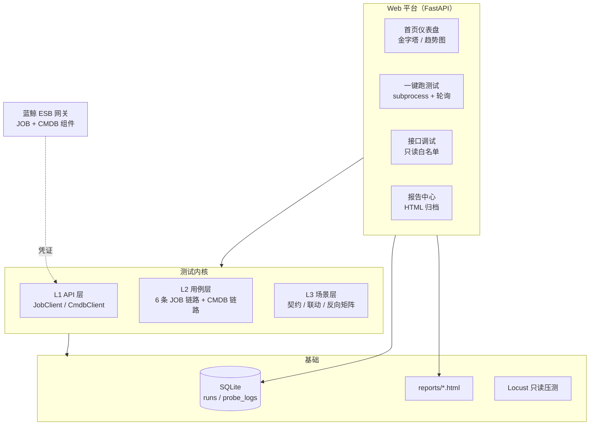

# 蓝鲸双系统端到端测试平台

> CMDB（配置管理）+ JOB（作业平台）双系统的全方位测试平台：
> pytest 分层用例 + FastAPI Web 平台 + SQLite 历史留痕 + Locust 只读压测，
> 覆盖功能 / 性能 / 安全 / 边界 / 端到端五个维度，另有 AI 用例生成。


## 它解决什么问题

面试作业背景：蓝鲸 JOB 提供 40+ ESB 接口，CMDB 提供配套查询接口，
两个系统通过业务 ID、主机 ID、动态分组 ID 三个数据契约耦合。
本平台回答两个问题：

1. **JOB 的每条链路单独工作正常吗？** —— 分层用例，故障隔离
2. **两个系统连起来数据对得上吗？** —— 场景矩阵，按契约组织

在这两个核心问题之上，按"全方位测试"要求覆盖五个维度：
**功能 / 性能 / 安全 / 边界 / 端到端**，全收在一个 Web 平台入口下
（详见 `docs/2026-08-23-全方位测试方案.md`）。

## 架构



## 测试分层（金字塔）

| 层 | 对齐术语 | 内容 | 触发 |
|----|---------|------|------|
| L1 | API 层 | 客户端封装自洽（拼参、Base64、分页构造） | `-m unit`，不等账号 |
| L2 | 用例层 | JOB 六链路 + CMDB 独立链路，分开测故障隔离 | `-m script` 等按链路 |
| L3 | 场景层 | 跨系统矩阵：契约一致性 / 业务联动 / 隔离反向 | `-m integration` |

三组 L3 场景围绕数据契约组织：

- **契约一致性**（只读）：JOB 的 `bk_scope_id` == CMDB 的 `bk_biz_id`，
  `host_id` == `bk_host_id`，`dynamic_group_list[].id` == CMDB 分组 ID
- **业务联动**：CMDB 圈人（动态分组）→ JOB 干活（快速执行/文件分发）
- **隔离反向**（负面）：CMDB 不存在的幽灵主机/幽灵分组，JOB 必须拒绝

## 目录结构

```
job-test/
├── app/                    # 产品代码
│   ├── api_client.py       #   JOB ESB 客户端（40+ 接口封装）
│   ├── cmdb_client.py      #   CMDB ESB 客户端
│   ├── storage.py          #   SQLite 存储层
│   ├── web_app.py          #   Web 平台（单文件 FastAPI）
│   ├── gen_cases.py        #   AI 用例生成器（DeepSeek）
│   └── job_config.py       #   配置（凭证填这里，不提交）
├── tests/                  # 测试代码（pytest，无包模式）
│   ├── conftest.py         #   客户端 fixture（凭证缺失诚实 skip）
│   └── test_*.py           #   分层用例 91 个
├── scripts/                # 工具脚本
│   ├── run_tests.py        #   统一测试入口（全量/链路 + 报告）
│   └── locustfile.py       #   只读接口压测
├── docs/                   # 策略文档 + 接口文档（apidoc/）
├── reports/                # HTML 报告（gitignore）
├── data/                   # SQLite 数据库（gitignore）
├── pytest.ini              # 分层 marker 注册
└── requirements.txt
```

## 快速开始

```bash
# 1. 安装依赖（Python 3.10+）
pip install -r requirements.txt

# 2. 配置凭证：复制 app/job_config.py 为 app/job_config_local.py，
#    在 local 文件里填三件套（模板入库、真凭证不入库，见 docs/申请指引）

# 3. 跑测试
python scripts/run_tests.py -m "unit and not platform"  # 冒烟 25 个，不等账号秒出
python scripts/run_tests.py -m unit                     # unit 层 32 个（含 7 个 Web 层）
python scripts/run_tests.py                             # 全量 91 用例 + HTML 报告

# 4. 启动 Web 平台
python app/web_app.py                      # → http://127.0.0.1:8000

# 5. 性能压测（可选，凭证配好后）
locust -f scripts/locustfile.py --host <ESB_HOST>
```

**未配置凭证时**：环境层用例全部诚实 skip（不造假绿），
unit 层 32 个用例正常跑，平台统计与报告照常出。

## Web 平台能力

- **仪表盘**：金字塔用例统计（实时 collect）、通过率趋势折线图
- **测试计划**：冒烟 / 回归 / 只 JOB / 只连块测，一键组合执行
- **接口调试**：Postman 式在线调 JOB/CMDB 只读接口（写操作白名单拒绝）
- **报告中心**：每次运行 HTML 报告归档，latest.html 永远最新
- **历史留痕**：SQLite 落库（runs + probe_logs），可审计可扩展

## 设计取舍

- **为什么 FastAPI 单文件**：阶段 0 定位"有脸可用"，内嵌 HTML + 原生 JS，
  零前端工程、零构建、断网可演示
- **为什么 SQLite 不 MySQL**：单文件零运维，sqlite3 标准库，足够趋势图场景
- **为什么压测只压只读**：共享体验环境黑名单约束，只读接口无副作用且是线上高频
- **为什么不造假绿**：凭证没到就 skip 并提示下一步，绝不 mock 成 pass

## License

MIT
